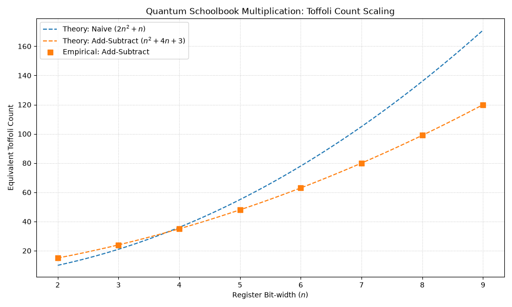

# Fault-Tolerant Quantum Arithmetic: Schoolbook Multiplication

This repository implements and benchmarks two fault-tolerant architectures for quantum schoolbook multiplication using Q# and the Azure Quantum Resource Estimator (QRE). This project was developed as part of the **Fault-Tolerant Quantum Computing** course at **EPFL**.

The core focus of this framework is the reduction of the non-Clifford volume—specifically the equivalent Toffoli gate count—which serves as the primary performance bottleneck in fault-tolerant quantum architectures (such as surface codes).

## Theoretical Foundations

This implementation bridges the low-level full-adder optimizations introduced by Craig Gidney with the high-level multiplication routing strategies derived by Markus Litinski.

1. **Craig Gidney (2018).** *"Halving the cost of quantum addition."* [arXiv:1709.06648](https://arxiv.org/abs/1709.06648)  
   Introduces the ripple-carry adder that leverages temporary logical-AND ancillas to compute carries using $n$ Toffoli gates during the forward sweep, and $0$ non-Clifford gates during the reverse sweep via measurement-based uncomputation.
2. **Markus Litinski (2019).** *"Quantum schoolbook multiplication with fewer Toffoli gates."* [arXiv:1905.07682](https://arxiv.org/abs/1905.07682)  
   Introduces the **Add-Subtract multiplication** technique. By replacing the traditional controlled-additions ($2n^2+n$ Toffolis) with an unconditional chain of add/subtract steps dictated by Clifford-based bit-preparations, it reduces the core arithmetic scaling to a quadratic bound of exactly $n^2$ Toffolis.

---

## Architecture Comparisons & Scaling Bounds

### 1. Naive Multiplication
* **Scaling:** $\mathcal{O}(2n^2)$ empirical ($\mathcal{O}(2n^2 + n)$ theoretical).
* **Mechanics:** Avoids compiler `Controlled` functor gate-bloat by manually allocating a temporary register `temp_y`. Inputs are conditionally copied via standard Toffolis before executing an uncontrolled Gidney ripple-carry addition.

### 2. Add-Subtract Multiplication
* **Scaling:** $\mathcal{O}(n^2 + 4n)$ empirical ($\mathcal{O}(n^2 + 4n + 3)$ theoretical).
* **Mechanics:** Eliminates controlled additions by performing unconditional add/subtract loops driven by Clifford boundary preparation (0 Toffoli cost). Resolves the accumulated algebraic offset using three out-of-loop corrections.

---

## Methodological Engineering: Mimicking measurement-based uncomputation

A Clifford-only `UncomputeCCNOT_Mock` operation simulates the 0-cost footprint of Gidney's non-unitary, measurement-based uncomputation while maintaining the unitary `is Adj` characteristic required by the compiler.

---

## Installation & Setup

This repository uses the modern `uv` package manager but supports standard `pip` workflows.

### Option A: Using `uv` (Recommended)
Ensure you have `uv` installed, then clone the repository and execute:
```bash
uv sync
uv run main.py
```

### Option B: Using `pip`

Create a virtual environment, install the dependencies listed in `pyproject.toml`, and execute:

```bash
python -m venv .venv
source .venv/bin/activate  # On Windows use: .venv\Scripts\activate
pip install -e .
python main.py
```

---

## Usage Guide

The repository splits functional state-vector verification from resource estimation tracing. Because `UncomputeCCNOT_Mock` leaves the ancilla wires entangled in the state-vector simulator, you must configure `src/Main.qs` depending on your current task.

### 1. Generating Toffoli Count Scaling Plots

To replicate the scaling benchmark graph comparing empirical profiling metrics against Litinski's and Gidney's theoretical limits:

1. Open `src/Main.qs`.

2. Ensure the reverse sweeps of `GidneyAdderWithCarryOut` and `GidneyAdderWithoutCarryOut` use the **mock operation**:

   ```qsharp
   // Active for Profiling/Estimation Tracing
   UncomputeCCNOT_Mock(a[i], b[i], cNext);
   ```

3. Execute `main.py` to prompt the Azure Quantum Resource Estimator across bit-widths $n \in [2, 9]$ and output the updated scaling curve.

### 2. Functional State-Vector Verification

To run exhaustive classical state tests to mathematically prove that the multiplication logic yields exact arithmetic products without leaking qubit entanglement:

1. Open `src/Main.qs`.

2. Swap out the mock operation for the **true unitary gate** to cleanly uncompute the wavefunction:

   ```qsharp
   // Active for Full State-Vector Simulation Testing
   CCNOT(a[i], b[i], cNext);
   ```

3. Call the test suite operation using the Q# evaluator:

   ```python
   import qsharp
   qsharp.init(project_root="./src")
   qsharp.eval("QuantumArithmetic.VerifyMultiplication_N3()")
   ```

   If all 64 basis states execute successfully without triggering a memory allocation release failure, your underlying quantum arithmetic logic is structurally bulletproof.

---

## Results

We managed to reproduce the exact theoretical scaling from Litinski's paper. Note that there had to be an artificial addition of +3 Toffoli gates in order for the match to be exact. This is believed to be due to each correction operation having been conservatively attributed an additional Toffoli gate.

<p align="center">
  
